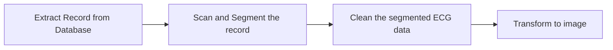

## ECG Signal Processing Pipeline

This repository houses code for preprocessing ECG signals, including cleaning, segmentation, and transformation into images. These processed ECG images can then be fed into custom networks or systems for in-depth analysis, classification, or prediction.

## Processing Steps

-Scan the given record: Input the ECG signal, window width, and window step to scan the record.

-Segment the record: Divide the scanned record into desired segments.

-Clean the segmented ECG data: Remove noise and artifacts from the segmented ECG.

-Transform to image: Convert the cleaned ECG segments into the desired image format.

### Getting Started
**1.Clone the Repository**
```
git clone https://github.com/KhaingSuThway/ECGSignalProcessingPipeline.git
cd ECGSignalProcessing

```

**2.Create a Virtual Environment** (optional but recommended)
``` 
python -m venv venv
source venv/bin/activate  # On Windows: venv\Scripts\activate
```

**3.Install Dependencies**
```
pip install -r requirements.txt
```


## Overview

### read_record.py
`read_record.py` is a Python module for reading ECG (Electrocardiogram) records in WFDB (Waveform Database) format. It provides functionality to read ECG signals, annotations, sample indices, comments, and sampling frequency from WFDB records and represents them as `Record` objects.

### Features
- Reads ECG records from WFDB format.
- Extracts ECG signals, annotations, sample indices, comments, and sampling frequency.
- Provides a `Record` class to represent ECG records.

### Usage
```python
from read_record import RecordReader

# Specify path to record directory, record name, channel, sample range
record = RecordReader.read(path='path/to/records', number='record_name', channel=0, sampfrom=0, sampto=1000)

# Access record attributes
print(record['parent'])  # Print parent of the record
print(record['label'])   # Print label or comment associated with the record
# Access other attributes similarly
```

### scanning_window.py

`scanning_window.py` is a Python module for analyzing ECG records by scanning through specified windows. It provides functions to calculate heart rate from ECG signals and scan through ECG records with or without rhythm intervals.

### Features
- Calculates heart rate from ECG signals.
- Scans ECG records within specified windows.
- Identifies different types of beats (e.g., AF, NSR, PAC, PVC) within each window.
- Determines the true class of each segment based on beat annotations and percentages.

### Usage
```python
from scanning_window import calculate_bpm, scan_record

# Calculate heart rate from ECG signal
heart_rate = calculate_bpm(signal, sampfreq)

# Scan ECG record within specified window
window_width = 5  # seconds
window_step = 1  # seconds
data_within_window = scan_record(record, window_width, window_step)
```

### transform_image.py

`transform_image.py` module provides functions to transform time series data, such as electrocardiogram (ECG) signals, into visual representations. It offers a range of methods to convert raw signal data into various types of images suitable for analysis and visualization.

### Features
- Combined Beat Image: Generate a combined beat image from an ECG signal, showcasing individual heartbeats overlaid on a single axis.
- Autocorrelation Plot Image: Create an autocorrelation plot from a time series signal, displaying the correlation between the signal and its lagged versions.
- Recurrence Plot Image: Generate a recurrence plot from a time series signal, illustrating the recurrence of states in a phase space reconstructed from the signal.
- Spectrogram Image (To be implemented): Produce a spectrogram image from a time series signal, revealing its frequency content over time.

These functions offer valuable insights into the characteristics and patterns present in time series data, facilitating further analysis and interpretation.

### Usage


```python

# Example usage of get_combined_beat_image function
from transform_image import get_combined_beat_image

# Provide ECG signal data and heart rate (BPM)
img_path = get_combined_beat_image(signal=ecg_signal, bpm=60, folder_name="images", img_name="combined_beat")
print("Image saved at:", img_path)

```