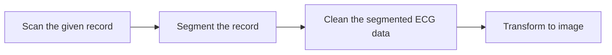

## ECG Signal Processing Pipeline

This repository houses code for preprocessing ECG signals, including cleaning, segmentation, and transformation into images. These processed ECG images can then be fed into custom networks or systems for in-depth analysis, classification, or prediction.

## Processing Steps

-Scan the given record: Input the ECG signal, window width, and window step to scan the record.

-Segment the record: Divide the scanned record into desired segments.

-Clean the segmented ECG data: Remove noise and artifacts from the segmented ECG.

-Transform to image: Convert the cleaned ECG segments into the desired image format.

#### Getting Started
**1.Clone the Repository**
```
git clone https://github.com/KhaingSuThway/ECGSignalProcessingPipeline.git
cd ECGSignalProcessing

```

**2.Create a Virtual Environment** (optional but recommended):
``` 
python -m venv venv
source venv/bin/activate  # On Windows: venv\Scripts\activate
```
